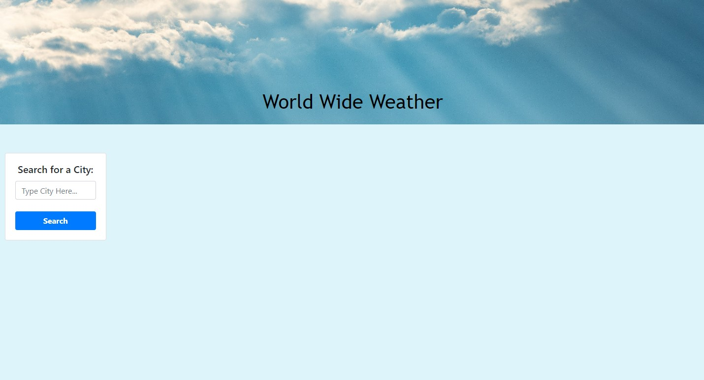
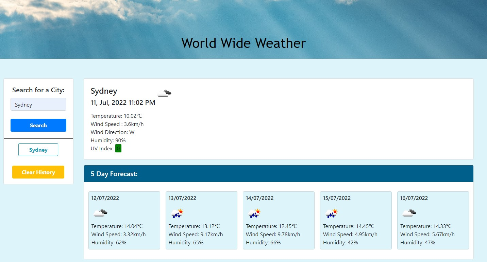
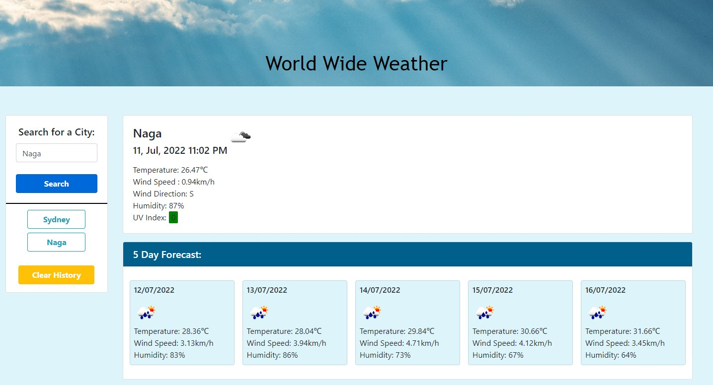
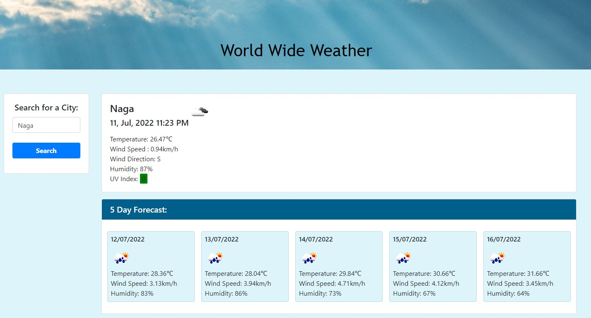

# weather-man
Global Weather Application

## Application Summary Description  

This application is a Weather Report and Forecast. It can display the weather in the form of todays weather and a 5day forecast for thousand's of cities all around the world.  

## Technologies Used

- HTML
- CSS
- JavaScript

## Motivation 

The motivation for this project was to develop a weather application to quickly search weather worldwide for when I am thinking of travelling to the city. The forecast gives the forecast for five days in from current day searched, so you can plan the travel. I utilised the openweatherAPI's as they have great documentation and simplistic design and supply a great amount and quality of data.

## Skills and Knowledge I learnt 

I learnt a lot from this application build primarily reinforcing my skills with Jquery and calling API's. The knowledge that I most thankful to gain from this project was how functions/scope and passing parameters into functions. I really developed my knowledge around these areas which I have definitely struggled with in the past and which should help a lot with future app development by being able to code and design the application with more clarity.

## Future developments
If I had more time:
 - Implement a dropdown box for the user to select the city they want if there are cities with the same name
 - I would also design the opening dashboard before the user searched more clearly with additional features
 - I would add error protection messages if the API call doesn't work for the searched city. 
 - I would add additional icons for wind direction as it currently has direction as text.
 - I would display more weather options such as rain radar or wind section etc.

## Website URL
[Click here to view website](https://eljsteer.github.io/weather-man/)

## Project Status
The application is deployed on the GitHub repository and URL above

## Screenshots

## Credits
- https://stackoverflow.com/questions/44177417/how-to-display-openweathermap-weather-icon
- https://stackoverflow.com/questions/2183863/how-to-set-height-width-to-image-using-jquery
- https://www.w3schools.com/jquery/jquery_css.asp
- https://www.pexels.com/photo/clouds-1431822/

## Acknowledgements
- University of Sydney Coding Bootcamp 
- Thanks for the Campfire Session and tips and tricks Mackenzie Gray 
- [OpenWeather API's (OneCall and Current Weather)](https://openweathermap.org/api)

## Badges

